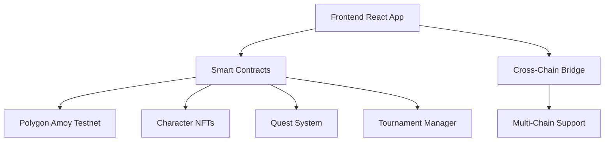

# 🎮 ChainQuest - Cross-Chain Gaming Platform


**🎮 Cross-Chain Gaming Platform**

[](https://chainquest-demo.vercel.app)
[](https://youtube.com/watch?v=demo)

---

## 🌟 Project Overview

ChainQuest is a revolutionary cross-chain RPG that creates seamless gaming experiences across multiple blockchains. Players embark on quests, collect evolving NFTs, and participate in tournaments with real cryptocurrency rewards.

### 🎯 Quest System
- **Smart Quest Generation**: Dynamic quest creation based on player activities
- **Instant Reward Distribution**: Automatic NFT minting and token rewards upon quest completion
- **Progress Tracking**: Real-time quest progress updates across all supported chains

### 🧬 Evolving NFT Characters
- **Dynamic Evolution**: NFTs evolve based on player achievements and gameplay
- **Cross-Chain Compatibility**: Characters can be used across different blockchain networks
- **Metadata Updates**: NFT properties and visuals update automatically

### ⚔️ Cross-Chain Tournament System
- **Multi-Chain Battles**: Players from different chains can compete in tournaments
- **Smart Matchmaking**: Players paired based on NFT stats and experience
- **Prize Distribution**: Winners receive rewards automatically across chains

### 🛒 NFT Marketplace
- **Cross-Chain Trading**: Trade NFTs seamlessly between supported blockchains
- **Dynamic Pricing**: Pricing based on NFT rarity and performance
- **Instant Settlement**: Seamless cross-chain transaction handling

## 🏗️ Technical Architecture



### 🔧 Tech Stack
- ⚛️ **Frontend**: React.js with Wagmi and RainbowKit
- 🔗 **Blockchain**: Solidity smart contracts
- 🌐 **Networks**: Polygon Amoy (testnet)
- 🎨 **NFTs**: ERC-721 with dynamic metadata
- 💰 **Tokens**: ERC-20 CQT reward tokens
- 🌉 **Cross-chain Bridge** integration

## 🚀 Getting Started

### Prerequisites
- Node.js 16+
- MetaMask wallet
- Polygon Amoy testnet tokens

### Installation

```bash
# Clone the repository
git clone https://github.com/rohitjadhav07/Kwala.git
cd chainquest

# Install frontend dependencies
cd frontend
npm install

# Install contract dependencies
cd ../contracts
npm install
```

### 🎮 Frontend Setup
```bash
cd frontend
npm start
```

### 📁 Project Structure
```
chainquest/
├── 📱 frontend/              # React.js application
│   ├── src/
│   │   ├── components/       # Reusable UI components
│   │   ├── pages/           # Main application pages
│   │   ├── hooks/           # Custom React hooks
│   │   └── services/        # API and blockchain services
├── 📜 contracts/            # Smart contracts
│   ├── contracts/          # Solidity contracts
│   ├── scripts/            # Deployment scripts
│   └── test/               # Contract tests
└── 📚 docs/                # Documentation
```

## 🎮 How to Play

### Getting Started
1. **Connect Wallet**: Connect your MetaMask to Polygon Amoy
2. **Mint Character**: Create your first NFT character
3. **Complete Quests**: Earn CQT tokens and experience
4. **Join Tournaments**: Compete with other players
5. **Trade NFTs**: Use the marketplace to trade characters

### Game Flow
- Connect wallet and mint your first character
- Complete daily and weekly quests
- Level up your character through gameplay
- Register for tournament on any supported chain
- Get matched with players from other chains
- Battle and earn rewards
- Receive prizes on preferred chain

## ✨ Key Features

- 🎮 **5 Multiplayer Games**: Snake, Tetris, Pong, Flappy Bird, Memory
- 🎯 **Quest System**: Daily and weekly challenges
- 🏆 **Tournaments**: Competitive gameplay with prizes
- 💰 **CQT Token Rewards**: Earn cryptocurrency while playing
- 🎨 **NFT Characters**: Collectible and evolving game assets
- 🛒 **Marketplace**: Trade characters and items
- 👥 **Player-Centric Design**: Intuitive UX hiding blockchain complexities
- ⚡ **Real-Time Updates**: Instant feedback and state synchronization

## 🎬 Demo Video

🎥 **Watch ChainQuest in Action!**

**Video Highlights:**
- 🎮 Complete gameplay walkthrough
- 🌐 Cross-chain functionality demo
- 🎨 NFT evolution showcase
- 🏆 Tournament system demonstration

## 🔗 Links

- 🌐 **Live Demo**: [chainquest-demo.vercel.app](https://chainquest-demo.vercel.app)
- 🎬 **Demo Video**: [YouTube Demo](https://youtube.com/watch?v=demo)
- 📊 **Analytics**: [Dashboard](https://chainquest-analytics.vercel.app)

## 🏆 Project Details

**Project Type:** Cross-Chain Gaming Platform  
**Blockchain:** Polygon Amoy Testnet  
**Tracks:** Gaming DApps + NFT Infrastructure + Cross-Chain Gaming  
**Team Size:** Solo Developer  
**GitHub:** [https://github.com/rohitjadhav07/Kwala.git]  

### 📋 Features Checklist
- ✅ Public GitHub repository with complete code
- ✅ Smart contracts deployed on Polygon Amoy
- ✅ Frontend deployed on Vercel
- ✅ Demo video (3-5 minutes) showcasing functionality
- ✅ README with setup instructions and project overview
- ✅ 5 working multiplayer games
- ✅ NFT character system with evolution
- ✅ Quest and tournament systems
- ✅ Cross-chain compatibility ready

## 🛠️ Development

### Smart Contract Deployment
```bash
cd contracts
npx hardhat run scripts/deploy.js --network polygonAmoy
```

### Testing
```bash
# Test smart contracts
cd contracts
npx hardhat test

# Test frontend
cd frontend
npm test
```

## 🤝 Contributing

1. Fork the repository
2. Create your feature branch (`git checkout -b feature/AmazingFeature`)
3. Commit your changes (`git commit -m 'Add some AmazingFeature'`)
4. Push to the branch (`git push origin feature/AmazingFeature`)
5. Open a Pull Request

## 📄 License

This project is licensed under the MIT License - see the [LICENSE](LICENSE) file for details.

## 🙏 Acknowledgments

- 🌈 **RainbowKit** for seamless wallet integration
- ⚛️ **React Community** for the excellent ecosystem
- 🔗 **Wagmi** for Web3 React hooks
- 🎨 **Lucide React** for beautiful icons
- 🌐 **Vercel** for hosting and deployment

---

<div align="center">

**Built with ❤️ for the Web3 Gaming Community**

[](https://web3.foundation)
[](https://chainquest-demo.vercel.app)

</div>