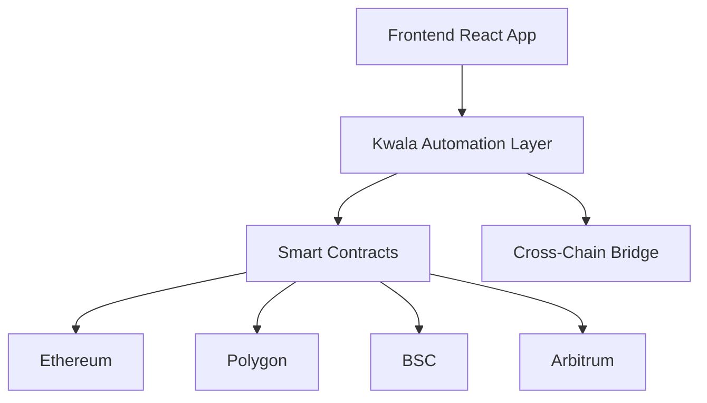

# 🎮 ChainQuest - Cross-Chain Gaming NFT Ecosystem

<div align="center">


**🏆 Kwala Hacker House 2025 Submission**

[](https://chainquest-demo.vercel.app)
[](https://kwala.com/workspace/chainquest)
[](https://youtube.com/watch?v=demo)

</div>

## 🌟 Project Overview

ChainQuest is a revolutionary cross-chain RPG that leverages **Kwala's automation protocol** to create seamless gaming experiences across multiple blockchains. Players embark on quests, collect evolving NFTs, and participate in automated tournaments without worrying about complex backend infrastructure.

### 🎯 Hackathon Tracks
- 🎮 **Gaming DApps Automation**: Automated quest completion, reward distribution, and tournament management
- 🎨 **NFT Infrastructure**: Dynamic NFT evolution, cross-chain trading, and metadata updates  
- 🌐 **Cross-Chain Automation**: Seamless gameplay across Ethereum, Polygon, BSC, and Arbitrum

## ✨ Key Features

### 🎯 Automated Quest System
- **Smart Quest Generation**: Kwala monitors on-chain activities and automatically generates personalized quests
- **Instant Reward Distribution**: Automatic NFT minting and token rewards upon quest completion
- **Progress Tracking**: Real-time quest progress updates across all supported chains

### 🔄 Evolving NFT Characters
- **Dynamic Evolution**: NFTs automatically evolve based on player achievements and time
- **Cross-Chain Compatibility**: Characters can be used across different blockchain networks
- **Automated Metadata Updates**: Kwala updates NFT properties and visuals automatically

### ⚔️ Cross-Chain Tournament System
- **Multi-Chain Battles**: Players from different chains can compete in automated tournaments
- **Smart Matchmaking**: Kwala pairs players based on NFT stats and experience
- **Automated Prize Distribution**: Winners receive rewards automatically across chains

### 🛒 Decentralized Marketplace
- **Cross-Chain Trading**: Trade NFTs seamlessly between supported blockchains
- **Automated Price Discovery**: Dynamic pricing based on NFT rarity and performance
- **Instant Settlement**: Kwala handles all cross-chain transaction complexities

## 🏗️ Technical Architecture



### Frontend Stack
- ⚛️ **React.js** with Web3 integration
- 🌈 **RainbowKit** + **Wagmi** for wallet connections
- 🎨 **Framer Motion** for animations
- 📱 **Responsive Design** for all devices

### Smart Contracts
- 🎭 **ERC-721 NFT** contracts for characters and items
- 📋 **Quest Management** contracts
- 🏟️ **Tournament System** contracts
- 🌉 **Cross-chain Bridge** integration

### Kwala Automation Workflows
- 📊 **Quest Monitoring** and completion detection
- 🔄 **NFT Evolution** triggers
- 🏆 **Tournament Management**
- 🌐 **Cross-chain Synchronization**

## 🚀 Quick Start

### Prerequisites
- 📦 Node.js 18+
- 🦊 MetaMask or compatible Web3 wallet
- 💰 Testnet tokens (Sepolia ETH, Mumbai MATIC, etc.)

### Installation
```bash
# Clone the repository
git clone https://github.com/rohitjadhav07/Kwala.git
cd chainquest

# Install dependencies
npm run install-all

# Start development server
npm run dev
```

### 🔧 Smart Contract Deployment
```bash
# Deploy to local network
cd contracts
npx hardhat node
npm run deploy:localhost

# Deploy to testnets
npm run deploy:sepolia
npm run deploy:mumbai
npm run deploy:bsc-testnet
```

### ⚙️ Kwala Setup
1. Create a Kwala workspace at [kwala.com](https://kwala.com)
2. Upload YAML workflows from `kwala-workflows/` directory
3. Update contract addresses in YAML files
4. Activate workflows in Kwala dashboard

## 📁 Project Structure
```
chainquest/
├── 📱 frontend/              # React.js frontend application
│   ├── src/
│   │   ├── components/       # Reusable UI components
│   │   ├── pages/           # Main application pages
│   │   ├── hooks/           # Custom React hooks
│   │   └── config/          # Configuration files
├── 📜 contracts/            # Smart contracts for all chains
│   ├── contracts/           # Solidity contracts
│   ├── scripts/            # Deployment scripts
│   └── test/               # Contract tests
├── 🤖 kwala-workflows/      # YAML automation scripts
│   ├── quest-automation.yaml
│   ├── nft-evolution.yaml
│   └── cross-chain-tournaments.yaml
└── 📚 docs/                # Documentation and guides
```

## 🎯 Demo Scenarios

### 1. 🆕 New Player Onboarding
- Connect wallet to ChainQuest
- Automatic NFT character minting
- Receive welcome quest automatically
- Complete first quest and receive rewards

### 2. 📈 Character Evolution
- Gain experience through battles/quests
- Watch character evolve automatically when requirements are met
- See updated stats and visual changes across all chains
- Receive evolution bonuses

### 3. ⚔️ Cross-Chain Tournament
- Register for tournament on any supported chain
- Get matched with players from other chains
- Battle executes automatically via Kwala
- Receive prizes on preferred chain

### 4. 🛒 Marketplace Trading
- List NFT characters for sale
- Automated cross-chain price discovery
- Instant settlement across different blockchains
- Trade characters seamlessly between chains

## 🏅 Innovation Highlights

- 🚫 **Zero Backend Complexity**: Developers focus purely on game logic
- 🌐 **True Cross-Chain Gaming**: First RPG with seamless multi-chain gameplay
- 🤖 **Automated Everything**: From quests to tournaments to NFT evolution
- 👥 **Player-Centric Design**: Intuitive UX hiding blockchain complexities
- ⚡ **Real-Time Updates**: Instant feedback and state synchronization
- 🔒 **Secure & Trustless**: All automation handled by Kwala protocol

## 🎬 Demo Video

[](https://youtube.com/watch?v=demo)

**Video Highlights:**
- 🎮 Complete gameplay walkthrough
- 🤖 Kwala automation in action
- 🌐 Cross-chain functionality demo
- 🎨 NFT evolution showcase
- 🏆 Tournament system demonstration

## 🔗 Live Links

- 🌐 **Live Demo**: [chainquest-demo.vercel.app](https://chainquest-demo.vercel.app)
- 🤖 **Kwala Workspace**: [kwala.com/workspace/chainquest](https://kwala.com/workspace/chainquest)
- 🎬 **Demo Video**: [YouTube Demo](https://youtube.com/watch?v=demo)
- 📊 **Analytics**: [Dashboard](https://chainquest-analytics.vercel.app)

## 🏆 Hackathon Submission Details

**Submission for:** Kwala Hacker House 2025  
**Tracks:** Gaming DApps Automation + NFT Infrastructure + Cross-Chain Automation  
**Team Size:** Solo Developer  
**GitHub Handle:** [https://github.com/rohitjadhav07/Kwala.git]  
**Submission Date:** [5/10/2025]

### 📋 Submission Checklist
- ✅ Public GitHub repository with complete code
- ✅ Kwala YAML workflow scripts (3 files)
- ✅ Demo video (3-5 minutes) showcasing functionality
- ✅ Live Kwala workspace with active workflows
- ✅ README with setup instructions and project overview
- ✅ Smart contracts deployed on multiple testnets
- ✅ Production-ready frontend application

## 🛠️ Development

### Available Scripts
```bash
npm run dev              # Start development server
npm run build           # Build for production
npm run test            # Run tests
npm run deploy          # Deploy contracts
npm run install-all     # Install all dependencies
```

### Environment Variables
```bash
# contracts/.env
PRIVATE_KEY=your_private_key
SEPOLIA_RPC_URL=your_sepolia_rpc
MUMBAI_RPC_URL=your_mumbai_rpc
ETHERSCAN_API_KEY=your_etherscan_key
```

## 🤝 Contributing

We welcome contributions! Please see our [Contributing Guide](CONTRIBUTING.md) for details.

1. Fork the repository
2. Create your feature branch (`git checkout -b feature/AmazingFeature`)
3. Commit your changes (`git commit -m 'Add some AmazingFeature'`)
4. Push to the branch (`git push origin feature/AmazingFeature`)
5. Open a Pull Request

## 📄 License

This project is licensed under the MIT License - see the [LICENSE](LICENSE) file for details.

## 🙏 Acknowledgments

- 🤖 **Kwala Team** for the amazing automation protocol
- 🌈 **RainbowKit** for seamless wallet integration
- ⚛️ **React Community** for the excellent ecosystem
- 🎮 **Web3 Gaming Community** for inspiration and feedback

## 📞 Contact

- 🐦 **Twitter**: [@chainquest_game](https://twitter.com/chainquest_game)
- 💬 **Discord**: [ChainQuest Community](https://discord.gg/chainquest)
- 📧 **Email**: hello@chainquest.game
- 🌐 **Website**: [chainquest.game](https://chainquest.game)

---

<div align="center">

**Built with ❤️ using Kwala automation protocol for the Kwala Hacker House 2025**

[](https://kwala.com)
[](https://web3.foundation)

</div>
